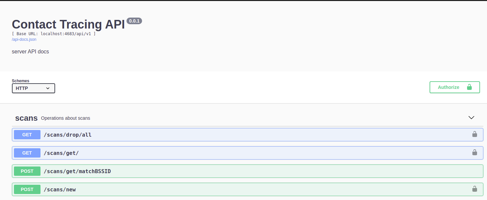

[![Release][release-shield]][release-url]
[![Forks][forks-shield]][forks-url]
[![Stargazers][stars-shield]][stars-url]
[![Issues][issues-shield]][issues-url]
[![MIT License][license-shield]][license-url]
[![LinkedIn][linkedin-shield]][linkedin-url]

<!-- PROJECT LOGO -->
<br />
<p align="center">
  <a href="https://github.com/wifi-tracing/server">
    
  </a>

<h3 align="center">Server</h3>

  <p align="center">
    Web server for a WiFi based contact tracing application, developed as part of <a href="https://github.com/danilo-delbusso"><b>@danilo-delbusso</b></a>'s a final year project
    <br />
    <a href="https://github.com/wifi-tracing/server/issues">Report Bug</a>
  </p>
</p>

# ℹ About The Project

This project contains a NodeJS based REST API to interface with the MongoDB backend provided for the WiFi contact
tracing project.

Automatically generated documentation can be accessed at [http://localhost:4863/api-docs](http://localhost:4683/api-docs) once
the project has started.

🚨 The docs only work if the Server is hosted at `localhost:4683`. To change this modify `swagger.js`.

<p align="center">
  
</p>

# 💽 Installation

## 🐋 Docker

This installation is the fastest, but requires [docker](https://docs.docker.com/engine/install/#server)
and [docker-compose](https://docs.docker.com/compose/install/#prerequisites).

This installation is also suggested for running on remote servers and cloud service providers.

Once you have installed these dependencies run

```bash
docker-compose up --build
```

The API will be available at `http://localhost:4683`

## 💻 Local Installation

To install locally without the use of Docker you will need the following dependencies installed and configured on your system:

- [Node.js](https://docs.npmjs.com/downloading-and-installing-node-js-and-npm)
- [npm](https://docs.npmjs.com/downloading-and-installing-node-js-and-npm)
- [MongoDB](https://docs.mongodb.com/manual/installation/)

It is suggested to install Node.js and npm using [nvm](https://github.com/nvm-sh/nvm#install--update-script).

Install local dependencies

```bash
npm install
```

Run with prettified logs

```bash
npm run dev
```

Or run without prettified logs

```bash
npm start
```

Or run using [PM2](https://www.npmjs.com/package/pm2)

```bash
pm2 start
```

# ⚙ Configuration

This repository contains a pre-packaged configuration in the form of an .env file.

While it is useful to demo and run the application, it is important to **CHANGE THE VALUES** for security reasons.

This is an overview of the used .env values:

| Name                  | Description                                                | Default Value                                                                                  |
| --------------------- | ---------------------------------------------------------- | ---------------------------------------------------------------------------------------------- |
| PORT                  | The server's port                                          | 4683                                                                                           |
| DOMAIN                | The server's domain                                        | localhost                                                                                      |
| API_PREFIX            | The base URL for the API                                   | /api/v1/                                                                                       |
| DOCKER_ENV            | true if the Server has to run in a Docker container        | false                                                                                          |
| DOCKER_DATABASE_URL   | The MongoDB URL used when DOCKER_ENV is "true"             | mongodb://mongo:27017/prj                                                                      |
| DATABASE_URL          | The MongoDB URL used when not DOCKER_ENV isn't "true"      | mongodb://localhost:27017/prj                                                                  |
| DB_NAME               | The name of the database                                   | prj                                                                                            |
| TOKEN_KEY             | The key used to generate JWTs                              | THIS_IS_A_SECRET_KEY                                                                           |
| TOKEN_EXPIRATION_TIME | The time of expiry for JWTs                                | 1m                                                                                             |
| DEV_UPLOAD_TOKEN      | A special token that bypasses token validation             | Jt(I9}SFd\~\|.}c^ZN?(4y8m?aI0\~-b                                                              |
| CACHE_ON_STARTUP      | Load cached features and heat-map data when first starting | false                                                                                          |
| GEOJSON_URL           | URL of the GEOJson feature collection used to cache data   | https://raw.githubusercontent.com/previsedigital/UK-GeoJSON/master/json/electoral/eng/wpc.json |

## 👷 PM2

The Server runs on the [PM2](https://www.npmjs.com/package/pm2) process manager. By default it will use **all** the cores available to it. To change this option, modify the `instances` property in the `ecosystem.config.js` file to the number of cores you want (e.g. `instances : 1`).

# 🗺 Roadmap

See the [open issues](https://github.com/wifi-tracing/server/issues) for a list of proposed features (and known issues).

<!-- CONTRIBUTING -->

# 💁 Contributing

Contributions are what make the open source community such an amazing place to be learn, inspire, and create.

The repo itself is just used to show the project. It is **NOT** actively maintained. The author suggests forking the
project instead of opening new issues.

<!-- LICENSE -->

# ⚖ License

Distributed under the MIT License. See `LICENSE` for more information.

<!-- CONTACT -->

# 🐦 Contact

Danilo Del Busso - [@danilo_delbusso](https://twitter.com/danilo_delbusso)

# 🙏 Attributions

<div>Icons made by <a href="https://www.freepik.com" title="Freepik">Freepik</a> from <a href="https://www.flaticon.com/" title="Flaticon">www.flaticon.com</a></div>

[release-shield]: https://img.shields.io/github/v/release/wifi-tracing/server?style=for-the-badge
[release-url]: https://github.com/wifi-tracing/server/releases
[forks-shield]: https://img.shields.io/github/forks/wifi-tracing/server.svg?style=for-the-badge
[forks-url]: https://github.com/wifi-tracing/server/network/members
[stars-shield]: https://img.shields.io/github/stars/wifi-tracing/server.svg?style=for-the-badge
[stars-url]: https://github.com/wifi-tracing/server/stargazers
[issues-shield]: https://img.shields.io/github/issues/wifi-tracing/server.svg?style=for-the-badge
[issues-url]: https://github.com/wifi-tracing/server/issues
[license-shield]: https://img.shields.io/github/license/wifi-tracing/server?style=for-the-badge
[license-url]: https://github.com/wifi-tracing/server/blob/master/LICENSE.txt
[linkedin-shield]: https://img.shields.io/badge/-LinkedIn-black.svg?style=for-the-badge&logo=linkedin&colorB=555
[linkedin-url]: https://www.linkedin.com/in/danilo-delbusso/
